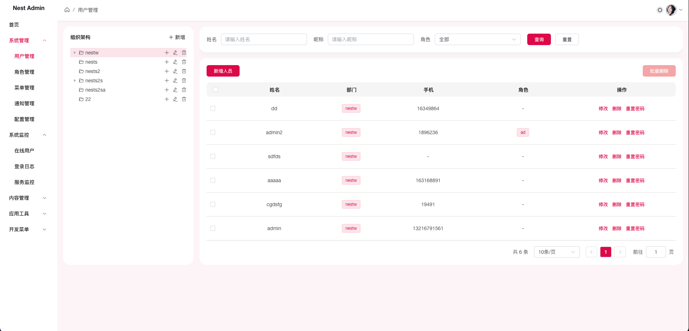
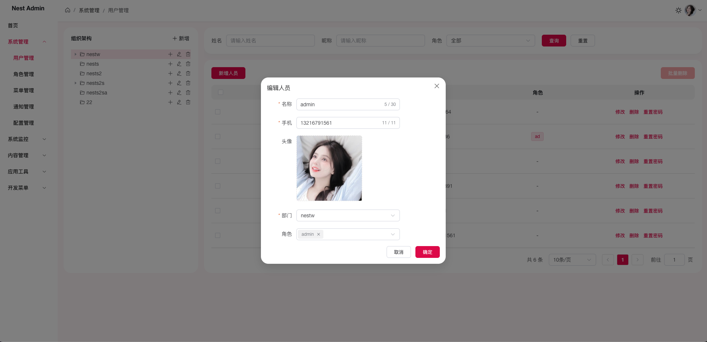
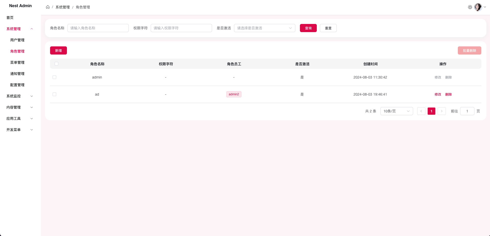
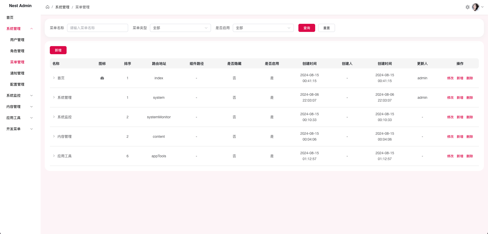
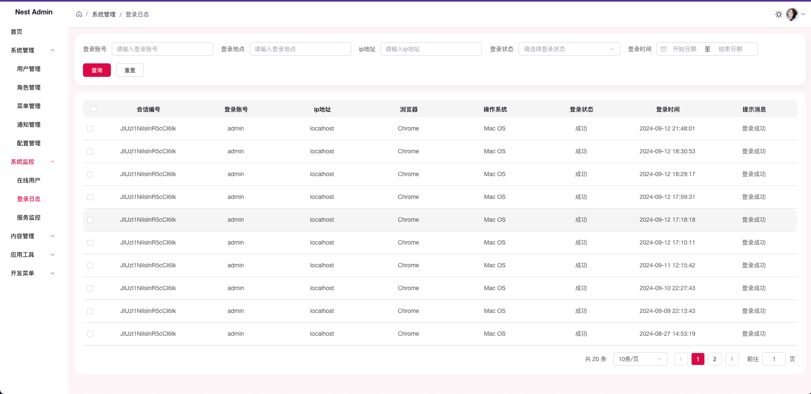
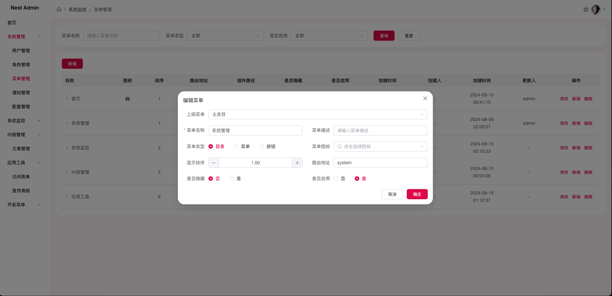

<h1 align="center">Nest Admin</h1>
<p align="center"><b>基于 Nestjs + Vue 前后端分离的 Nodejs 中后台权限管理系统快速开发框架</b></p>
<p align="center"><b>你的 ⭐️ Star ⭐️ 就是最美的支持</b></p>
<p align="center">
<a href="https://gitee.com/hixinla/nest-admin" target="_blank"></a>
<a href="https://gitee.com/hixinla/nest-admin" target="_blank"></a>
</p>

## 平台简介

- [Nest Admin](https://nestts.com/) 是一套基于 Nestjs + Vue 前后端分离的 Nodejs 中后台权限管理系统快速开发框架。
- 前端采用 Vue3 + Vite + Element Plus 生态，后端采用 Nestjs + TypeOrm + MySql + Redis 生态。
- 核心模块包括用户、角色、菜单、部门等，权限认证使用Jwt，支持加载动态权限菜单等功能。
- 可以帮您快速搭建企业级中后台 RBAC 管理平台。
- github地址：https://github.com/xinla/nest-admin
- 国内gitee地址：https://gitee.com/hixinla/nest-admin

另外，Nest Admin 使用 [cmd-deploy](https://www.npmjs.com/package/cmd-deploy) npm插件进行前后端的自动化部署，也欢迎大家Star。谢谢~

## 内置功能

1. 用户管理：配置系统操作用户，角色等。
2. 部门管理：配置系统组织机构（公司、部门），树结构展现支持数据权限。
3. 菜单管理：配置系统菜单，操作权限等
4. 角色管理：配置系统角色，角色可分配权限。
5. 通知管理：发布系统通知，公告等。
6. 配置管理：配置系统相关信息。
7. 在线用户：查看在线用户信息。
8. 登录日志：配置系统角色，角色可分配权限。
9. 服务监控：监控服务信息状态。
10. 文章管理：发布管理文章。

## 未来计划

- [ ] 接入腾讯混元AI
- [ ] 构建文档站点
- [ ] 海报生成器
- [ ] 开放前端库
- [ ] 丰富前端主题
- [ ] 表单生成器
- [ ] 数据大屏
- [ ] 数字孪生 3D  
       ...

如果觉得 [Nest Admin](https://gitee.com/hixinla/nest-admin) 有帮助到您，点个免费的 ⭐️ Star ⭐️ 就是最美的支持  
Star 越快，更得越快~

## 功能演示

演示地址：https://nestts.com

账密：admin/123456








## 目录结构

```
├── bin                        # 脚本
│   │── build.sh               # 部署构建脚本
├── config                     # 项目配置
│   │── index.ts               # 配置文件
│   │── secret.ts              # 密钥配置
├── deploy                     # cmd-deploy 自动化部署
│   │── deploy.config.mjs      # 自动化部署配置
├── doc                        # 项目文档
│   │── sql                    # sql 脚本
│── dist                       # 构建目录
├── src                        # 源代码
│   ├── common                 # 公共文件
│   ├── modules                # 系统模块
│   ├── modulesBusi            # 业务模块
│   ├── app.controller.spec.ts # 测试用例
│   ├── app.controller.ts      # 根路由
│   ├── app.module.ts          # 根模块
│   ├── app.service.ts         # 根服务
│   ├── main.ts                # 入口文件 加载组件 初始化等
├── test                       # 测试脚本
├── upload                     # 文件上传存储目录
├── LICENSE                    # LICENSE文件
├── .prettierrc                # prettier格式化配置
├── package.json               # package.json
├── README.md                  # README
├── RELEASE.md                 # 发布日志
├── tsconfig.json              # tsconfig 配置
```

## 安装

本地需要提前安装 nodejs v20+

```bash
# clone 项目
git clone https://gitee.com/hixinla/nest-admin.git

# 进入项目根目录
cd nest-admin

# 安装依赖
# 方式一： npm 指定淘宝镜像
npm i --registry=https://registry.npmmirror.com

# 方式二： 使用 cnpm 安装
npm install -g cnpm --registry=https://registry.npmmirror.com
cnpm i

# 方式三： npm i 原始安装 国内推荐上述两种方式 DDDD(懂的都懂)
npm i
```

## 配置

1. 在 `config/config.ts`里的 `databaseList.dev`中配置本地数据库连接信息
2. 执行 `doc/sql/nest_admin.sql` 文件，创建表到数据库中
3. 执行 `doc/sql` 文件夹下的其他sql 文件，导入对应表数据到数据库中

## 运行

```bash
# 本地开发
$ npm run dev
# 或
$ npm run start:dev

# 线上运行
$ npm run start:prod
```

在应用程序运行后, 打开浏览器并访问 http://localhost:3000/。 你应该看到 Hello world! 信息。

## 部署

1. 和本地运行类似，在服务器执行上面安装和配置步骤

2. 然后安装 [pm2](https://pm2.io/docs/plus/overview/)，目前使用 pm2 启动和管理node项目进程。有关pm2 的更多信息，请查看 [pm2 文档](https://pm2.io/docs/plus/overview/)。国内打不开的话，可以自行搜索相关中文网站。

3. 执行 `npm run build`

4. 执行 `pm2 start "npm run start:prod"` 即可启动。

## 一键自动化部署

- [`bin/build.sh`](bin/build.sh)是服务器构建运行脚本，后续更新部署可直接在服务器项目根目录下执行 `bash bin/build.sh` 即可。

- 更简单的是，当前使用自动化部署插件 [cmd-deploy](https://www.npmjs.com/package/cmd-deploy)，借助插件，直接在本地执行 `deploy prod` 即可完成线上部署。有关 `cmd-deploy` 的使用，可参考 [cmd-deploy 文档](https://www.npmjs.com/package/cmd-deploy)。

- 以下是 cmd-deploy 配置文件 deploy.config.mjs 的远程命令配置  
  `remoteCommand: ['cd /usr/local/nest/admin', './bin/build.sh'], // 线上环境打包脚本`

## 支持

点个免费的 ⭐️ Star ⭐️ 就是最美的支持

如果有什么问题，欢迎提 issue，欢迎 PR。

## 协议

Nest Admin 使用 [MIT](LICENSE) 开源许可协议.
